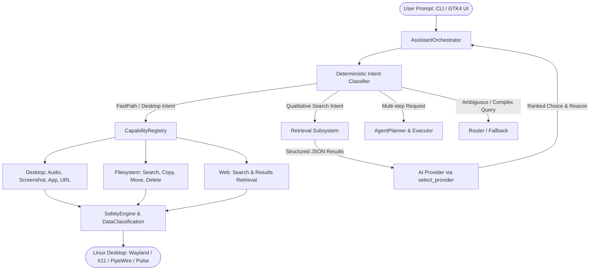

# AVI Project Status Report

**Date:** September 7, 2026  
**Current Version:** `0.4.0`  
**Current Branch:** `main` (synchronized with `origin/main`)  
**Test Suite Health:** 906 passed, 2 skipped (100% green across Python 3.10, 3.11, 3.12)  
**CI Pipeline:** Passing on all matrix runners  

---

## 1. Executive Summary

AVI (**Autonomous Virtual Intelligence**) is an open-source, local-first Linux desktop AI assistant and agentic runtime. Built with strict security boundaries, native system capabilities, and model-agnostic AI reasoning, AVI bridges the gap between natural language user requests and deterministic desktop actions.

Over recent development sprints (Phases 12 through 13.1), AVI has transitioned from a command router with basic shell safety into a **full capability-driven assistant and retrieval agent**. Users can speak or type commands to manipulate desktop hardware (audio, screens), control applications and files, conduct web research, retrieve structured YouTube media, and reason over results—all with zero shell injection risk, sub-millisecond local intent routing, and complete provider portability.

---

## 2. Architecture & Subsystem Overview

### Core Subsystems

1. **Assistant Orchestrator (`src/avi/orchestrator/`)**
   - Central coordination layer mediating between user prompts, native actions, capability registries, retrieval providers, and conversation state.
   - Preserves multi-turn state (`ConversationHistory`, `ConversationTurn`) enabling deictic follow-up requests (e.g. *"open it"*, *"open the second one"*).

2. **Intent Classification & Conversational Synthesis (`src/avi/assistant/`)**
   - High-throughput regex and heuristic intent parser (`detect_assistant_intent`) with sub-millisecond response times.
   - Extracts structured targets, duration constraints, volume deltas, search parameters, and clarification triggers without requiring an LLM call.
   - Natural language synthesis for disk, memory, CPU, and running processes (`synthesizer.py`).

3. **Unified Capability System (`src/avi/capabilities/`)**
   - Typed, schema-validated capabilities inheriting from `BaseCapability`.
   - `desktop.*`: volume get/set/mute (`wpctl`, `amixer`), screen capture (`grim`, `scrot`, `maim`), notification (`notify-send`), app launcher, URL opener.
   - `filesystem.*`: bounded search, copy, move, directory creation, safe delete with confirmation prompts.
   - `web.*`: YouTube direct search and structured metadata retrieval.
   - Built-in data classification (`DataClassification.LOCAL_ONLY`) to prevent unintentional exfiltration of local visual artifacts.

4. **Web Retrieval Subsystem (`src/avi/retrieval/`)**
   - Provider-independent retrieval abstraction (`BaseSearchProvider`).
   - InnerTube API client (`YouTubeSearchRetrievalProvider`) fetching structured video metadata without requiring browser automation or external API keys.
   - Strict HTTPS URL validation (`validate_youtube_url`) preventing protocol or destination spoofing.

5. **Provider Abstraction & Negotiation (`src/avi/providers/`)**
   - Model-agnostic design supporting Ollama, local LLMs, and Antigravity.
   - Capability negotiation via `ProviderCapabilities.supports()` allowing runtime selection of providers with `text_reasoning`, `structured_output`, or `vision`.

6. **Desktop UI (`src/avi/ui/`)**
   - Native GTK4 floating assistant window with Catppuccin Mocha theme.
   - Multi-bubble conversation history: user queries, assistant replies, interactive result cards with `[Open]` actions, inline confirmation cards, and error cards.
   - Non-blocking execution loop communicating across background worker threads via `GLib.idle_add`.
   - Single-instance activation via PID file locking and desktop IPC.

---

## 3. Detailed Progress by Phase

### Phase 12.0 — Agent Runtime + Desktop Assistant
- Established `CapabilityRegistry` and migrated ad-hoc tools to typed capabilities.
- Implemented Wayland/X11 screen capture (`desktop.screenshot`) with local PNG dimension parsing.
- Built `AgentPlanner` and `AgentExecutor` for bounded multi-step plans (up to 5 steps with rollback and confirmation).
- Created `avi activate` single-instance launcher.

### Phase 12.1 — Native CLI Routing Integration
- Resolved critical bug where CLI inputs (e.g., `avi "increase volume"`) bypassed capabilities and fell through to legacy shell-command generation.
- Enforced direct capability execution for volume, screenshot, and application actions.

### Phase 12.2 — Routing Gaps, Typo Safety & Activation Fixes
- Added support for mute/unmute phrasing (`"mute volume"`, `"turn sound back on"`).
- Implemented fuzzy matching with Levenshtein distance for desktop intents.
- Locked down domain boundaries to prevent arbitrary natural language from triggering system actions.
- Hardened single-instance activation across all Linux desktop environments.

### Phase 12.3 — GTK4 UI Stabilization & Assistant UX
- Eliminated legacy GTK3 API calls (`override_font`, deprecated `TextView` methods) causing crashes on GTK4/PyGObject.
- Introduced conversation cards with dedicated user/assistant styling.
- Enabled one-click opening for captured screenshots and local files.

### Phase 13.0 — Native Search Capabilities
- Added `web.youtube.search` capability.
- Differentiated between navigation (`"open YouTube"`) and search (`"search YouTube for Linux tutorials"`).
- Built safe URL generator (`build_youtube_search_url`) with strict parameter encoding.

### Phase 13.1 — Web Retrieval & Result Reasoning
- Created the `avi.retrieval` package for structured content fetching.
- Added `web.youtube.search_results` capability.
- Added `YOUTUBE_RECOMMEND` intent (e.g. *"find me a good YouTube video about building local AI agents"*): retrieves results, applies duration/quality filters, prompts an AI provider for ranking, and synthesizes a recommendation.
- Added `OPEN_SEARCH_RESULT` intent for multi-turn deictic resolution (*"open it"*, *"open the second one"*).
- Added interactive result cards in GTK4 UI.
- Fixed environment-sensitive `sys.argv` forwarding in tests to achieve 100% CI pass rate across Python 3.10, 3.11, and 3.12.

---

## 4. Current Test Suite & Quality Status

| Category | Count | Status |
| :--- | :--- | :--- |
| **Unit Tests** | 711 | Passing |
| **Integration Tests** | 195 | Passing |
| **Skipped Tests** | 2 | Conditionally skipped (headless GTK display probes) |
| **Total Test Count** | **906** | **All Green** |
| **Ruff Linter** | 114 files | 0 errors |
| **Ruff Formatter** | 114 files | Clean |
| **Python Compatibility** | 3.10, 3.11, 3.12 | Verified |
| **Version Parity** | `0.4.0` | Verified |

---

## 5. Summary of Verified User Commands

| Prompt Example | Subsystem / Capability | Behavior |
| :--- | :--- | :--- |
| `avi "increase volume"` | `desktop.volume.set` | Adjusts volume by +5% via PipeWire/PulseAudio |
| `avi "mute volume"` | `desktop.volume.set` | Mutes audio without shell generation |
| `avi "take a screenshot"` | `desktop.screenshot` | Saves timestamped PNG to `~/Pictures/Screenshots/` |
| `avi "how much disk space do I have"` | `synthesizer` + `df` | Returns conversational summary of root drive |
| `avi "set a timer for 10 minutes"` | `actions.TimerAction` | Starts async countdown daemon with bell alert |
| `avi "open Firefox"` | `desktop.app.launch` | Resolves `.desktop` entry and spawns process |
| `avi "search YouTube for Python tutorials"` | `web.youtube.search` | Opens browser directly to query results page |
| `avi "find me a good video on Docker"` | `web.youtube.search_results` | Fetches metadata, ranks with AI, recommends best match |
| `avi "open it"` (after search) | `OPEN_SEARCH_RESULT` | Validates YouTube URL and launches browser |
| `avi activate` | `AviWindow` (GTK4) | Summons or focuses floating desktop assistant |

---

## 6. Next Steps & Roadmap

1. **Phase 13.2 — Web Search Broadening (DuckDuckGo / SearXNG)**
   - Expand `avi.retrieval` with a general web search provider for web queries beyond YouTube.
   - Structured summarization for documentation, recipes, and news.

2. **Phase 14 — Vision & Screen Understanding**
   - Connect `desktop.screenshot` output with vision-capable model providers (Gemini, local multimodal models).
   - Answer visual questions (*"what is currently on my screen?"*, *"summarize this error window"*).

3. **System Daemon & Global Shortcuts**
   - Provide an optional user systemd service (`avi.service`) for instant hotkey response without cold startup lag.
